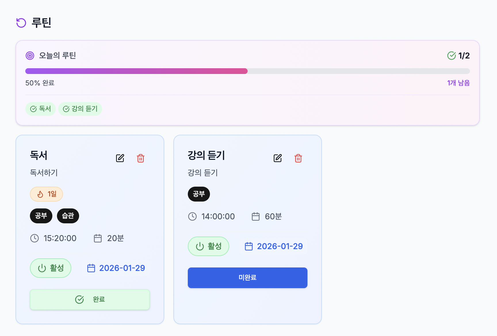
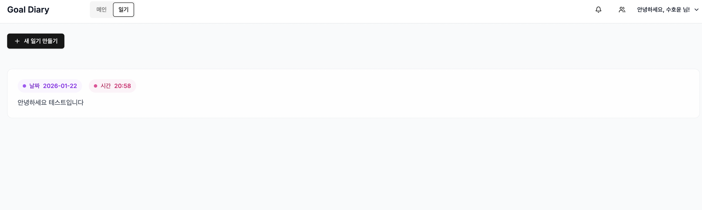

## GoalDiary - 목표 관리 및 일정 관리 플랫폼

🌐 **사이트 주소**: [https://goaldiary.vercel.app/](https://goaldiary.vercel.app/)

> 개인의 목표, 명언, 일기와 팀 협업을 하나로 통합한 혁신적인 생산성 관리 플랫폼

## 🔍 한눈에 보는 프로젝트

- **무엇을 해결하나**: 오늘 해야 할 일이 많을 때, 중요한 것(BIG3)이 무엇인지부터 잡고 **시간에 박아 넣을 수 있는 일정 도구**입니다.
- **어떻게 다르나**: 일반 Todo처럼 체크만 하는 것이 아니라, **BIG1/BIG2/BIG3를 먼저 고르고 → 그걸 우선으로 시간 배정 → 나머지 작업을 주변에 배치**하는 플로우를 강제합니다.
- **어떤 기능이 있나**: 일정/루틴/명언/일기/팀 협업/알림까지, **개인 생산성과 팀 협업을 한 화면에서** 관리할 수 있습니다.

## 📋 프로젝트 개요

GoalDiary는 **“그냥 Todo를 위에서부터 체크하는 방식”이 불편해서 직접 설계한 일정 관리 방식**을 구현한 프로젝트입니다.

기존 일정/투두 앱을 쓰면서 느낀 문제는:

- 하루에 해야 할 일을 쭉 적어도, **무엇이 진짜 중요한지 한눈에 안 보인다.**
- 중요한 일을 먼저 시간에 배치하기보다, 그때그때 일정이 끼어들면서 **우선순위가 흐려진다.**

GoalDiary에서는 이 문제를 해결하기 위해 다음과 같은 **고유한 플로우**를 채택했습니다:

- 먼저 **그날 해야 할 모든 일을 자유롭게 쭉 적는다.**
- 그 다음, 그중에서 **BIG1 / BIG2 / BIG3 (오늘의 Top 3)** 를 고른다.
- 선택한 BIG3를 **먼저 캘린더에 시간으로 박아 넣고**, 나머지 일정을 그 주변에 배치한다.

즉, 단순한 투두 리스트가 아니라 **“오늘 꼭 지켜야 할 핵심 3가지(BIG3)를 먼저 시간에 고정하고 나머지를 설계하는 일정 도구”**라는 점이 기존 일정 관리 앱과의 가장 큰 차별점입니다.  
이 위에 명언, 일기, 루틴, 팀 협업 기능을 얹어서 **개인 성장 + 협업**을 함께 다루는 생산성 플랫폼으로 확장했습니다.

**기술 스택:**

- **Frontend**: Next.js 15, React 18, TypeScript, Tailwind CSS, React Query, Socket.io Client
- **Backend**: NestJS, TypeORM, PostgreSQL, Socket.io, JWT
- **배포**: Vercel (Frontend), AWS/Cloud (Backend)

---

## 🚀 주요 기능

### 1. 스케줄 관리 시스템

#### 📅 일정 생성 및 관리

- 일정 생성, 수정, 삭제
- 할 일 카드(Content Items) 추가/편집/삭제
- 시간 설정 (시작 시간, 종료 시간)
- 완료 상태 토글


#### ⏰ 시간 교환 기능

- 버튼 기반 시간 교환 시스템
- 두 개의 일정 항목을 선택하여 시간대를 서로 교환
- 실시간 유효성 검증 (시간 중복 방지)

#### 🏆 BIG 랭킹 시스템 (BIG1, BIG2, BIG3)

- 일정 항목에 우선순위 랭킹 부여
- BIG1, BIG2, BIG3 버튼으로 중요도 설정
- 오늘의 스케줄 타임라인에 BIG 랭크 표시
- 시간이 없는 항목도 BIG 랭크가 있으면 타임라인에 표시

#### 📊 오늘의 스케줄 타임라인

- 시간이 있는 일정을 시간순으로 표시
- BIG 랭크가 있는 항목도 우선순위에 따라 표시
- 타임라인에서 직접 완료 상태 토글 가능

---

### 2. 루틴 관리 시스템

#### 🔄 루틴 생성 및 추적

- 루틴 생성, 수정, 삭제
- 카테고리, 일정, 시간, 지속 시간 설정
- 루틴 완료 처리 및 취소

#### 📈 루틴 통계

- 연속 달성 일수 (Streak) 추적
- 오늘의 루틴 완료율 프로그레스 바
- 루틴 통계 조회

> 
>
> - 루틴 목록 및 완료율 프로그레스 바
> - 루틴 상세 페이지 (연속 달성 일수 표시)

---

### 3. 명언(Quote) 관리

#### 💬 명언 카드 시스템

- 명언 생성, 수정, 삭제
- 저자 정보 및 관련 링크 추가
- 3개의 명언 슬롯 제공
- 긴 텍스트는 "더 보기/접기" 기능으로 전체 내용 확인 가능

> 

---

### 4. 일기(Diary) 관리

#### 📝 일기 작성 및 관리

- 일기 작성, 수정, 삭제
- 일기 목록 조회
- 시간 정보 포함 일기 작성

> 

---

### 5. 팀 협업 기능 ⭐

#### 👥 팀 관리 및 초대 시스템

- **팀 생성**: 간단한 이름 입력으로 팀 생성
- **멤버 초대**: 사용자 ID 기반으로 팀 멤버 초대
- **초대 상태 관리**: PENDING → ACTIVE/REJECTED 상태 전환
- **팀 멤버 목록**: 팀에 속한 모든 멤버 조회
- **개인 일정 → 팀 일정 전환**: 기존 일정을 팀 일정으로 쉽게 전환

> - 
> - 

#### 🔔 실시간 알림 시스템

- **팀 초대 알림**: 팀에 초대되면 즉시 알림 수신
- **알림 타입**:
    - `TEAM_INVITATION`: 팀 초대 알림
    - `TEAM_REMOVED`: 팀에서 제거 알림
    - `TEAM_DELETED`: 팀 삭제 알림
- **알림 읽음 처리**: 개별/전체 읽음 처리
- **알림 내에서 바로 수락/거절**: 알림 모달에서 바로 초대 응답 가능
- **무한 스크롤**: Intersection Observer를 활용한 효율적인 알림 목록 로딩
- **읽지 않은 알림 개수 표시**: 실시간으로 읽지 않은 알림 개수 표시

> 📸 **스크린샷 필요**:
>
> - 
> - 

#### 🔄 실시간 동기화 (WebSocket)

- **팀 일정 실시간 동기화**: 팀 일정 변경사항이 모든 멤버에게 즉시 반영
- **Socket.io 기반**: 양방향 통신으로 즉각적인 업데이트
- **스케줄 단위 룸**: 각 스케줄별로 WebSocket 룸 분리
- **동시 작업 지원**: 여러 사용자가 동시에 작업해도 충돌 없이 동기화

---

### 6. 인증 및 보안

#### 🔐 JWT 기반 인증

- 회원가입, 로그인, 로그아웃
- JWT 토큰 기반 세션 관리
- 보호된 라우트 (인증 필요)

---

## 🏗️ 아키텍처

### Monorepo 구조

```
todoDndMonoRepo/
├── apps/
│   ├── goalDiaryFront/    # Next.js 프론트엔드
│   └── goalDiaryBack/     # NestJS 백엔드
└── packages/
    └── types/              # 공유 타입 정의
```

### 주요 디렉토리 구조

**Frontend:**

- `src/app/(route)/main/` - 메인 페이지 및 스케줄 상세
- `src/app/components/` - 재사용 가능한 컴포넌트
- `src/app/hooks/` - 커스텀 훅 (API, 비즈니스 로직)
- `src/api/` - API 클라이언트 함수
- `src/type/` - TypeScript 타입 정의

**Backend:**

- `src/content-item/` - 할 일 카드 관리
- `src/schedule/` - 일정 관리
- `src/routine/` - 루틴 관리
- `src/team/` - 팀 관리
- `src/auth/` - 인증 관련
- `src/migrations/` - 데이터베이스 마이그레이션

---

## 🔧 주요 기술적 특징

### 1. 상태 관리

- **React Query**: 서버 상태 관리 및 캐싱
- **Optimistic Updates**: UI 즉시 반영 후 서버 동기화
- **WebSocket**: 실시간 데이터 동기화

### 2. 코드 구조

- **컴포넌트 분리**: Container/Presentation 패턴
- **커스텀 훅**: 비즈니스 로직과 UI 로직 분리
- **타입 안정성**: TypeScript로 엔드투엔드 타입 안정성 보장

### 3. 데이터베이스

- **TypeORM**: ORM을 통한 데이터베이스 관리
- **마이그레이션**: 버전 관리된 스키마 변경
- **관계형 데이터**: 일정, 할 일, 팀, 사용자 간 관계 설정

### 4. API 설계

- **RESTful API**: 표준 REST 엔드포인트
- **DTO 검증**: class-validator를 통한 요청 데이터 검증
- **에러 핸들링**: 일관된 에러 응답 형식

---

## 📦 설치 및 실행

### 필수 요구사항

- Node.js >= 18
- PostgreSQL
- pnpm >= 9.0.0

### 설치

```bash
# 루트에서 의존성 설치
pnpm install
```

### 실행

```bash
# 개발 모드 (프론트엔드 + 백엔드 동시 실행)
pnpm dev

# 또는 개별 실행
cd apps/goalDiaryBack && pnpm dev
cd apps/goalDiaryFront && pnpm dev
```

### 데이터베이스 마이그레이션

```bash
cd apps/goalDiaryBack
pnpm migration:run
```

---

## 🎯 주요 구현 사항

### 1. 시간 교환 로직

- 두 일정 항목의 시간대를 서로 교환하는 전용 API 엔드포인트
- 프론트엔드에서 시간 중복 검증
- 버튼 기반 선택 UI로 사용자 경험 개선

### 2. BIG 랭킹 시스템

- 데이터베이스에 `bigRank` 컬럼 추가 (1, 2, 3 또는 null)
- 타임라인에서 시간 있는 항목 우선, 그 다음 BIG 랭크 항목 표시
- BIG 랭크 버튼 토글 기능

### 3. 팀 초대 및 알림 시스템

- **초대 프로세스**: 팀 생성 → 멤버 초대 → 알림 발송 → 수락/거절
- **알림 엔티티**: Notification 테이블로 모든 알림 관리
- **페이지네이션**: 무한 스크롤로 효율적인 알림 목록 로딩
- **실시간 알림**: WebSocket을 통한 실시간 알림 수신 (향후 확장 가능)
- **메타데이터 관리**: 알림에 팀 정보, 멤버십 ID 등 추가 정보 포함

### 4. 실시간 동기화

- Socket.io를 통한 팀 일정 실시간 동기화
- 스케줄 단위로 WebSocket 룸 분리
- 변경사항 발생 시 모든 연결된 클라이언트에 브로드캐스트

### 5. 코드 리팩토링

- 컴포넌트별 커스텀 훅으로 로직 분리
- UI 관련 로직과 API 호출 로직 분리
- 가독성 향상을 위한 변수 추출 및 구조 개선

---

## 📝 API 엔드포인트 (주요)

### 스케줄 (Schedules)

- `GET /schedules` - 일정 목록 조회
- `POST /schedules` - 일정 생성
- `GET /schedules/:id` - 일정 상세 조회
- `PATCH /schedules/:id` - 일정 수정
- `DELETE /schedules/:id` - 일정 삭제

### 할 일 카드 (Content Items)

- `GET /content-items` - 할 일 카드 목록 조회
- `POST /content-items` - 할 일 카드 생성
- `PATCH /content-items/:id` - 할 일 카드 수정 (시간, 텍스트, 완료 상태, BIG 랭크)
- `DELETE /content-items/:id` - 할 일 카드 삭제
- `PATCH /content-items/swap-times` - 두 할 일 카드의 시간 교환

### 루틴 (Routines)

- `GET /routines` - 루틴 목록 조회
- `POST /routines` - 루틴 생성
- `PATCH /routines/:id` - 루틴 수정
- `DELETE /routines/:id` - 루틴 삭제
- `POST /routines/:id/complete` - 루틴 완료 처리
- `GET /routines/stats` - 루틴 통계 조회

### 팀 (Teams)

- `POST /teams` - 팀 생성
- `POST /teams/:teamId/invite` - 팀 멤버 초대 (알림 자동 생성)
- `PATCH /teams/invitations/:membershipId` - 초대 수락/거절
- `GET /teams/:teamId/members` - 팀 멤버 목록 조회
- `GET /teams/:teamId` - 팀 정보 조회

### 알림 (Notifications)

- `GET /notifications` - 알림 목록 조회 (페이지네이션 지원)
- `PATCH /notifications/:id/read` - 알림 읽음 처리
- `PATCH /notifications/read-all` - 모든 알림 읽음 처리

### 명언 (Quotes)

- `GET /quotes` - 명언 목록 조회
- `POST /quotes` - 명언 생성
- `PATCH /quotes/:id` - 명언 수정
- `DELETE /quotes/:id` - 명언 삭제

---

## 🎨 UI/UX 특징

- **반응형 디자인**: 모바일, 태블릿, 데스크톱 지원
- **다크 모드 준비**: Tailwind CSS 기반 스타일링
- **로딩 상태**: 사용자 피드백을 위한 로딩 오버레이
- **Toast 알림**: 작업 성공/실패 알림
- **알림 배지**: 읽지 않은 알림 개수 실시간 표시
- **드래그 앤 드롭**: 직관적인 인터페이스 (향후 확장 가능)

---
